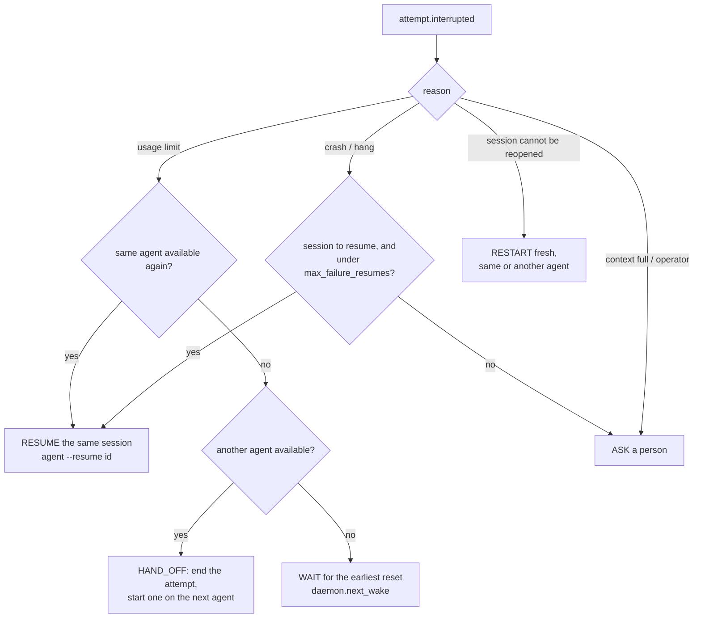

# Architecture: the life of one task

This page follows one task from `baton task add` to the "Done" message on Telegram, and
names the file and function behind each step. Read it top to bottom; the decisions behind
the design are in [docs/adr/](adr/README.md).

## The shape of it

baton is one Python process, **batond**, plus a small Rust program, **baton-detect**. It
never runs agents itself. It asks [herdr](https://github.com/herdrdev/herdr), a terminal
multiplexer for coding agents, to open panes and type into them, over herdr's socket API
(ADR 0003).

Three rules hold everywhere:

1. **The event log is the truth** (ADR 0002). Every decision and every observation is
   appended to an SQLite table as an immutable event before anything acts on it. The
   board you see in `baton status` is folded from the log (`core/projection.py`,
   `project()`), never stored.
2. **The core is pure.** `core/` holds the model, the events and the ports (protocols).
   It imports no other baton package; [import-linter](../pyproject.toml) enforces this and
   the layers: `cli/daemon/telegram → scheduler/budget/recovery/policy →
   herdr/adapters/ledger/collector/detector/workdir → core`.
3. **Decisions are pure functions; the runner only carries them out.** What to do next
   (`scheduler/turn.py`), how to recover (`recovery/policy.py`), which agent to choose
   (`budget/choice.py`) and whether a command may run (`policy/rules.py`) are all plain
   functions over data, tested as tables.

```mermaid
sequenceDiagram
    autonumber
    actor You
    participant CLI as baton CLI
    participant Log as Event log (SQLite)
    participant D as batond loop<br/>daemon.serve
    participant R as TaskRunner<br/>scheduler/runner.py
    participant B as Budget<br/>budget/
    participant H as herdr<br/>herdr/host.py
    participant A as Agent CLI<br/>(in a herdr pane)
    participant Det as Detector<br/>Python / Rust
    participant T as Telegram

    You->>CLI: baton task add "power function" -C ~/src/calc
    CLI->>Log: task.created
    D->>Log: read, select_tasks()
    D->>R: run(task_id)
    R->>B: BudgetReader.read() → choose_agent()
    R->>Log: task.agent_chosen (agent, reason)
    R->>Log: attempt.started, attempt.located
    R->>H: open_pane, send_text("claude"), send_keys(Enter)
    H->>A: starts the agent
    R->>T: Started on claude. Why: …
    loop every herdr event, or every 2 s
        R->>H: watch / observe, read_screen
        R->>Det: classify(screen, herdr's state)
        Det-->>R: idle / working / blocked / rate_limited / crashed …
        R->>Log: attempt.state_observed (when it changes)
    end
    R->>Log: attempt.prompted
    R->>H: send_prompt(task + end contract)
    A-->>H: works…, then "You've hit your session limit · resets 4:30pm"
    R->>Log: attempt.interrupted (rate_limited, resume_not_before)
    R->>Log: attempt.ended (abandoned), task.agent_chosen, attempt.started (codex)
    R->>T: Moved from claude to codex. claude hit its usage limit; available again at 16:30.
    A-->>H: codex finishes; idle with [[BATON:END status=done]]
    R->>Log: attempt.ended (completed), task.completed
    R->>T: Done on codex in 14 min. Tokens, files changed, budget left.
```

## Step by step

### 1. A task is added

`baton task add` (`cli.py`, `task_add`) calls `daemon.add_task`, which appends one event,
`task.created`, with the title, the instructions and the working directory. Then it
wakes batond (`daemon.poke`); the CLI never runs the task itself.

- Events: `core/events.py`. Each event has a stable `type` string (`task.created`,
  `attempt.started`, …) and is validated by pydantic on the way in and out.
- Store: `ledger/store.py`, `SqliteEventStore.append`. Writes are append-only, with
  optimistic concurrency (`expected_seq`). The schema is managed by Alembic
  (`ledger/migrations/`).

### 2. batond picks it up

`baton daemon` (or the systemd unit from `baton service install`) runs `daemon.serve`. Each
cycle:

1. `run_pending` folds the log into the board and asks `scheduler/queue.py`,
   `select_tasks`, which tasks may make progress now. A task is run again only when
   something it depends on changed: its own events, or which agents are available.
2. Tasks run one at a time, oldest first, through `TaskRunner.run`.
3. Between cycles batond sleeps 30 s, or until the next limit resets (`next_wake`). It
   wakes at once when the Telegram bot acts, or when a CLI command (`task add`,
   `approve`, …) writes to the FIFO next to the event log (`daemon.poke`, `listening`).

`daemon.open_runtime` is the composition root. It is the only place that knows which real
implementation stands behind each port (event store, pane host, notifier, detector,
policy).

### 3. An agent is chosen, with a reason

`TaskRunner._choose_agent` reads each agent's remaining budget and picks one
([ADR 0012](adr/0012-remaining-budget.md)):

- `budget/load.py`, `BudgetReader.read`, folds the event log and the usage tables:
  - Codex's own `rate_limits` reports;
  - Claude's tokens against its five-hour window, an estimate marked as one.
- `budget/availability.py`, `fold_availability`: who is limited, until when. This comes
  from limits agents actually hit, read from `attempt.interrupted`.
- `budget/choice.py`, `choose_agent`: the configured preference order. An agent below
  `reserve_percent` moves behind the others, and a limited agent is skipped. It returns
  the agent and the reason in words.

The choice is logged as `task.agent_chosen` before the attempt starts, so "why did it go to
Codex?" is always answerable from the log.

Token usage gets into the usage tables through `collector/usage.py`, `UsageCollector`. It
runs `baton-detect usage` (Rust), which tails the agents' own session logs and prints one
JSON line per response. Usage records are telemetry, not task events, so they go to their
own tables (`ledger/usage.py`).

### 4. The agent is started in a herdr pane

`TaskRunner._attempt`:

1. `core/commands.py`, `start_attempt`, creates `attempt.started` with a new attempt id
   and the git commit the work starts from.
2. `herdr/host.py`, `HerdrPaneHost.open_pane`, opens a pane in baton's own herdr
   workspace. The pane id is recorded as `attempt.located`.
3. The agent's launch command is typed into the pane (`send_text`, `send_keys`), the way
   a person would (ADR 0005). baton never touches the agents' credentials.
4. Telegram gets "Started on claude", with the scheduler's reason.

The pane and the agent session are *locations* of the attempt, not its identity
([ADR 0006](adr/0006-attempt-identity-and-location.md)). Before anything is typed,
`core/targeting.py`, `resolve_target`, checks that the pane still hosts this attempt's
agent and session. A pane that now runs something else never receives input.

### 5. The runner watches, and the detector says what it sees

`TaskRunner._supervise` loops until the turn is over:

- **Observations.** `_ObservationFeed` takes herdr's `pane.agent_status_changed` events,
  and reads the pane every `poll_interval_seconds` (2 s) in between. A limit message can
  appear under an unchanged status. `herdr/state.py`, `derive_state`, turns herdr's status
  into baton's states, and treats herdr's "no rule matched, so idle" fallback as `unknown`.
- **Classification.** `_classify` reads the bottom of the screen and asks the detector.
  The detector applies the agent's rules (`crates/baton-detect/rules/claude.toml`,
  `codex.toml`, `opencode.toml`). These rules recognise what herdr does not: usage limits
  with their reset time, a full context, permission prompts versus questions.
- **The detector** is `baton-detect classify` (Rust, `crates/baton-detect/src/classify/`),
  one long-running child process (`detector/process.py`, `ProcessDetector`;
  [ADR 0011](adr/0011-baton-detect-in-rust.md)). Its rules
  (`crates/baton-detect/rules/*.toml`) are data in herdr's own field names. While it
  gives no answer, `FallbackDetector` uses `core/detector.py`, `HostDetector`: herdr's
  working and blocked pass, idle reads as unknown, so nothing finishes or moves without
  the rules.
  - It got there by a strangler migration. A Python copy of the rules decided first, then
    both ran side by side in `shadow` mode on real work, with no difference. Then the
    Python copy was removed.
  - The answers on 1,949 recorded and generated screens are pinned in
    `tests/golden/classify.jsonl`.
- **Deciding.** `scheduler/turn.py`, `next_step`, is a pure function of the turn so far
  and the current state. It returns one of: wait, send the prompt, answer a known start-up
  dialog, finish, ask a person, interrupt. `recovery/policy.py`, `assess`, supplies the
  verdict.
- **Sending the task.** When the agent first shows its idle prompt, the runner appends
  `attempt.prompted`, then sends the task. The event comes first, so a restarted batond
  never sends a prompt twice. Every prompt ends with the end contract
  (`core/contract.py`): the agent ends with `[[BATON:END status=done|question|blocked]]`,
  so a question is not mistaken for a finished task.

### 6. When the agent needs a decision

A permission prompt (`blocked_permission`) first goes to the **policy**
([ADR 0013](adr/0013-permission-policy.md)):

1. The adapter reads the command from the screen (`permission_command`).
2. `policy/rules.py`, `decide`, splits it into the commands the shell would run and
   decides each part against `~/.config/baton/policy.yaml`, then the defaults.
3. The decision is logged as `attempt.permission_decided`. `allow` and `deny` are carried
   out through the same checked path an operator's tap uses (`scheduler/operator.py`,
   `act`).

Anything else that needs a person (`ask`, a question, an unreadable prompt) becomes a
notice with the end of the screen, through `scheduler/notices.py`. The task waits. The
operator answers in one of three places:
- at the terminal;
- from the CLI (`baton approve|deny|answer`);
- on Telegram (`telegram/bot.py`, `OperatorBot`).

Remote actions are bound to the exact prompt they were shown for, carried out at most
once, and only into a verified pane
([ADR 0009](adr/0009-remote-operator-actions.md)). Each is logged as `operator.acted`.

### 7. A limit, a crash, a hang

`TaskRunner._interrupt` appends `attempt.interrupted`, with the reason and, for a limit,
`resume_not_before`, read from the agent's own message. `run()` then asks
`recovery/policy.py`, `plan_recovery`. It is a pure function:



- **Resume** (`_resume`): a new pane, the agent's own resume command
  (`claude --resume <id>`), and a short "continue" prompt. The agent keeps its context.
- **Hand-off** (`_attempt` with `previous`): a new attempt on another agent, with a note
  that earlier work is in the working directory. Telegram says from whom to whom, and
  when the limit lifts, in local time.
- **Wait**: the run ends. batond sleeps until `next_wake`, then the same `plan_recovery`
  resumes the session.
- **A hang** has no screen of its own. `_no_progress` (`scheduler/stall.py`) interrupts a
  working agent as `stalled` when, for `stall_minutes` (15), its screen has not changed
  (counters and spinners aside) and no tokens were recorded for its session
  ([ADR 0014](adr/0014-stall-detection.md)). The turn timeout stays as the backstop.

batond itself may restart at any point. On the next cycle, `_reattach` rebuilds the turn
from the log (`turn_from_log`) and carries on where the events say it stood.

### 8. Done

When an agent that has worked is idle again, and its end mark (if it printed one) says `done`, `_finish` runs:

1. `core/commands.py`, `complete_task`, appends `attempt.ended` and `task.completed`
   together; a task never closes with a live attempt.
2. The done notice gathers:
   - the duration;
   - the attempt's own tokens (`BudgetReader.spent`, by session);
   - the files changed since the first attempt's commit (`workdir/git.py`,
     `GitWorkspace.changes`, read-only);
   - the agent's budget left.

### 9. Telegram

Every notice is a structured `core/notify.py`, `Notice`. `telegram/notifier.py` renders
it:
- `format_notice` makes HTML: the title first, the task id last;
- `redact` (`core/redact.py`) masks anything shaped like a secret, the bot's own token
  included;
- permission prompts get Approve / Deny buttons.

The bot accepts commands from one owner only (`/status`, `/budget`, replies, buttons).

## Where to look next

| Question | File |
|---|---|
| What states exist and what they mean | `core/model.py`, [ADR 0004](adr/0004-agent-state-model.md) |
| How a screen becomes a state | `adapters/*.py`, `core/detection.py`, `fixtures/` (recorded screens) |
| How a run is replayed or inspected | `core/projection.py`, `baton status` |
| What baton may automate at all | [ADR 0005](adr/0005-automation-boundaries.md) |
| How it behaves under limits, crashes and hangs, measured | [bench/](../bench/README.md), `just bench` |
| How the classifier is tested | `tests/integration/test_classify_golden.py`, `tests/golden/classify.jsonl` |
